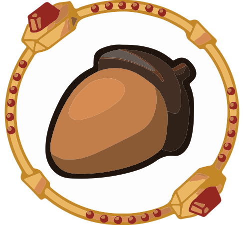
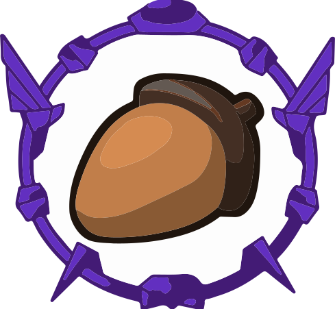

<h1 align="center">

   
    
    
    
  
</h1>

<p align="center">
  

  
  
  <a href="https://github.com/josephpatrick1/casa-na-arvore/commits/master">
    
  </a>

 <a href="https://github.com/josephpatrick1/casa-na-arvore/issues">
    
  </a>

  <a href="https://github.com/josephpatrick1/casa-na-arvore/blob/master/LICENSE.md">
    
  <a>
</p>

<p align="center">
  <a href="#rocket-tecnologias">Tecnologias</a>&nbsp;&nbsp;&nbsp;|&nbsp;&nbsp;&nbsp;
  <a href="#-projeto">Projeto</a>&nbsp;&nbsp;&nbsp;|&nbsp;&nbsp;&nbsp;
  <a href="#-backend">Backend</a>&nbsp;&nbsp;&nbsp;|&nbsp;&nbsp;&nbsp;
  <a href="#-frontend">Frontend</a>&nbsp;&nbsp;&nbsp;|&nbsp;&nbsp;&nbsp;
  <a href="#-instalação">Instalação</a>&nbsp;&nbsp;&nbsp;|&nbsp;&nbsp;&nbsp;
  <a href="#-instalação">Como contribuir</a>&nbsp;&nbsp;&nbsp;|&nbsp;&nbsp;&nbsp;
  <a href="#memo-licença">Licença</a>
</p>

<br>

---

## 💻 Projeto

  <h1 align="center">
  
 </h1>

Projeto desenvolvido durante a <strong>Mega Hack 3º Edição</strong> promovido pela empresa <strong>Shawee</strong>.
O <strong>Casa na Árvore</strong> é uma solução criada para o desafio <strong>Árvore</strong>, onde visa amenizar o problema de falta/difícil conectividade e solucionar o problema da falta de interesse pela leitura, trazendo uma dinamica de gamificação para dentro do ambiente de leitura

## 🚀 Tecnologias

Esse projeto foi desenvolvido com as seguintes tecnologias:

- [TypeScript](https://github.com/Microsoft/TypeScript)
- [Node.js](https://nodejs.org/en/)
- [React](https://reactjs.org)
- [Ionic](https://ionicframework.com/)
- [Celebrate](https://github.com/arb/celebrate)
- [Knex](http://knexjs.org/)
- [Axios](https://github.com/axios/axios)
- [Express](https://expressjs.com/pt-br/guide/routing.html)

## 🔨 Backend

O back-end foi construido com [Node.js](https://nodejs.org/en/), todo escrito com [TypeScrip](https://github.com/Microsoft/TypeScript), que quando compilado gera code JavaScript puro.

O [Express](https://expressjs.com/pt-br/guide/routing.html) foi usado para lidar com as rotas de forma simples e eficaz, e foi aplicado o [Cors](https://github.com/expressjs/cors) assim possibilitando uma conexão mais segura e o [Celebrate](https://github.com/arb/celebrate) para validar as requisições.

O [Knex](http://knexjs.org/) foi o ORM escolhido para o nosso gerenciamento com banco de dados que em ambiente de desenvolvimento esta sendo usado o SQLite3.

O [Insomnia](https://insomnia.rest/) nos auxiliou para testar as requisições de nossas rotas.

<h1 align="center">
  <a href="https://insomnia.rest/run/?label=Casa%20na%20Arvore&uri=https%3A%2F%2Fgithub.com%2Fjosephpatrick1%2Fcasa-na-arvore%2Fblob%2Fmaster%2FInsomnia_.json%2F" target="_blank"></a>
</h1>

## 📱 🌐 FrontEnd

Todo construído em [React](https://reactjs.org) e escrito em [TypeScript](https://github.com/Microsoft/TypeScript).
Para obter a conexão com as api's esta sendo usado [Axios](https://github.com/axios/axios).
Na cosntrução da aplicação PWA, usamos o [Ionic](https://ionicframework.com/) para acesso às API’s nativas e gerar componentes estilosos de maneira prática.

## 🔥 Instalação

```bash
# Clone este repositório
$ https://github.com/TadeuA/NLW-1https://github.com/josephpatrick1/casa-na-arvore.git

# Navegue até a pasta server e execute os seguintes comandos:
$ yarn install or npm install
$ yarn knex:migrate or npm run knex:migrate
$ yarn knex:seed or npm run knex:seed
$ yarn dev or npm run dev
# Depois disso, entre na pasta frontend e execute os comandos:
$ yarn install or npm install
$ yarn start or npm run start

# Observações:
- Não esqueça de mudar a baseURL no arquivo api.ts das pastas web e mobile para o ip da sua máquina
```

## 🤔 Como contribuir

- Faça um clone desse repositório `git clone https://github.com/josephpatrick1/casa-na-arvore.git`;
- Cria uma branch com a sua feature: `git checkout -b minha-feature`;
- Faça commit das suas alterações: `git commit -m 'feat: Minha nova feature'`;
- Faça push para da sua branch: `git push git push --set-upstream origin minha-feature`.

Depois que o merge da sua pull request for feito, você pode deletar a sua branch.

## 🧾 Licença

Esse projeto está sob a licença MIT. Veja o arquivo [LICENSE](LICENSE.md) para mais detalhes.

---
